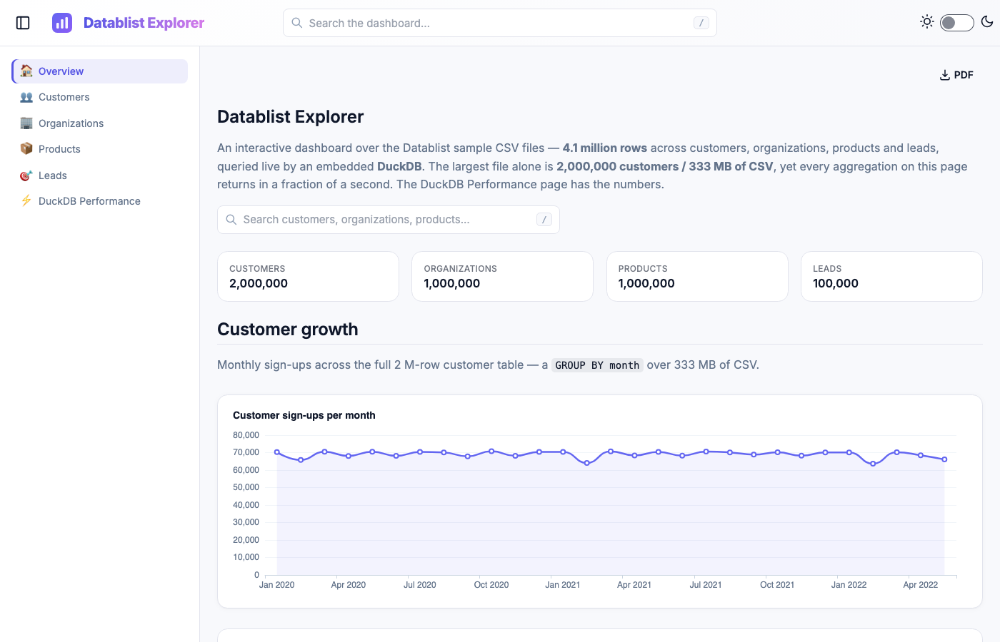
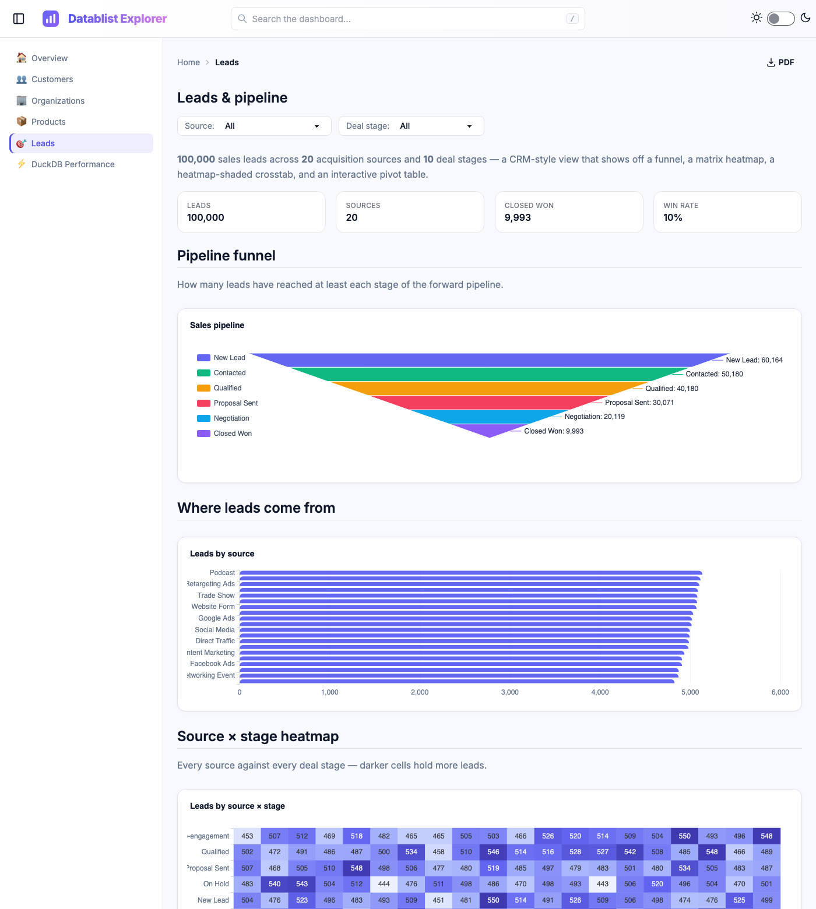

# Datablist Explorer — a Dashdown + DuckDB demo

### ▶ Live demo: **https://direndai.github.io/dashdown-csv-demo/**

An interactive analytics dashboard built with **Dashdown** over the
[Datablist sample CSV files](https://github.com/datablist/sample-csv-files). It loads the
**largest** sample files — **2,000,000 customers (333 MB)**, **1,000,000 organizations**,
**1,000,000 products** — plus a **100,000-row leads** set, and queries them live with an
embedded **DuckDB**, so you can see how fast columnar SQL chews through hundreds of megabytes
of raw CSV.

> **4.1 million rows. No database server. Aggregations in well under a second.**



## What's in it

| Page | Highlights |
| ---- | ---------- |
| **Overview** (`/`) | KPI counters, sign-up trend, a category treemap, top industries, full-text `<SiteSearch>`, and an AI `<Ask>` read-out |
| **Customers** (`/customers`) | 2 M rows — sign-ups over time, a GitHub-style **calendar heatmap**, top countries, a filterable record table, and a **drill-down by country** |
| **Organizations** (`/organizations`) | founding-year trend, top industries, filterable table, **drill-down by industry** |
| **Products** (`/products`) | category treemap, price histogram, availability mix, average price by category, **drill-down by category** |
| **Leads** (`/leads`) | a pipeline **funnel**, a Source × Stage **heatmap**, a heatmap-shaded **table** (from a DuckDB `PIVOT`), an interactive **pivot table**, and a **drill-down by source** |
| **DuckDB Performance** (`/performance`) | the row counts and measured timings behind the "how fast is it?" story |
| Detail pages | one template each renders a focused page for every country / industry / category / source (`pages/**/[param].md` + `static_paths`) |



**Components used:** `Counter`, `LineChart`, `BarChart`, `PieChart`, `TreemapChart`,
`FunnelChart`, `HeatmapChart`, `CalendarHeatmap`, `PivotTable`, `Table` (sortable, searchable,
CSV-exportable, clickable rows, optional `heatmap` shading), `Value`, `Grid`, `Dropdown`,
`Search`, `SiteSearch`, and `Ask` (LLM commentary, via Mistral).

## How it works

```
data/*.csv  ──►  DuckDB (one table per file)  ──►  SQL queries  ──►  charts & tables
   (fetched at build time, never committed)         queries/*.sql + inline :::query
```

- **`sources.yaml`** points the `main` connector at `data/`; each CSV becomes a DuckDB table
  (`customers.csv` → `customers`).
- **`queries/`** holds the reusable SQL; pages reference it by name (`data={customers.signups_by_month}`).
  Page-specific / filtered SQL lives inline in `:::query` blocks.
- **`dashdown build`** runs every query once, writes the results to JSON snapshots, and emits a
  fully static site — which is what gets deployed to GitHub Pages (no server, no API keys at view time).

### A note on filtering (live vs. static)

`<Dropdown>` / `<Search>` controls drive **server-side** SQL re-queries, so they're fully
interactive when you run `dashdown serve .` (DuckDB re-runs over all the rows as you type). In a
**static export** those controls are stripped and each query is baked to its default ("all")
result. What stays interactive in the deployed site:

- **Table search / sort / pagination** (client-side, over the loaded rows),
- **drill-down navigation** — click a country / industry / category row to open its pre-built page,
- **`<SiteSearch>`** full-text search across every page.

## Run it locally

Requires Python 3.10+.

```bash
pip install -r requirements.txt        # dashdown-md[mistral] + gdown
python scripts/fetch_data.py           # downloads ~620 MB of CSV into data/ (idempotent)

export MISTRAL_API_KEY=...             # optional — only the <Ask> component needs it
dashdown serve .                       # http://127.0.0.1:8000  (live, fully interactive)
```

> `MISTRAL_API_KEY` is read by the `llm:` block in `dashdown.yaml`. If you don't have a key,
> comment out that block to skip the AI feature, or just set any value — the `<Ask>` cards will
> show a notice and everything else works.

Other useful commands:

```bash
dashdown check                 # config + every page renders?
dashdown query --tables -c main            # what DuckDB sees
dashdown build . --out .dist               # the static export (what CI deploys)
dashdown screenshot /products              # PNG + "did the charts actually draw?" (needs the [pdf] extra)
```

## Deploy to GitHub Pages

A GitHub Actions workflow (`.github/workflows/deploy.yml`) fetches the data, builds the static
site, and publishes it on every push to `main`.

1. **Push this repo to GitHub.**
2. **Settings → Pages → Build and deployment → Source: GitHub Actions.**
3. *(Optional, for live AI commentary)* **Settings → Secrets and variables → Actions** → add
   `MISTRAL_API_KEY`. Without it the deploy still succeeds; the `<Ask>` cards just show a notice.

The workflow caches the downloaded CSVs (keyed on `scripts/fetch_data.py`), so only the first run
pays the download cost. The export uses **relative base hrefs**, so it works correctly under the
`username.github.io/<repo>/` sub-path with no extra configuration.

## Data

Generated random data from [datablist/sample-csv-files](https://github.com/datablist/sample-csv-files)
(Python Faker). The CSVs are **not** committed — the 2 M-row customers file alone exceeds GitHub's
100 MB per-file limit — so `scripts/fetch_data.py` downloads them on demand. Schemas:

- **customers** — Index, Customer Id, First/Last Name, Company, City, Country, Phone ×2, Email, Subscription Date, Website
- **organizations** — Index, Organization Id, Name, Website, Country, Description, Founded, Industry, Number of employees
- **products** — Index, Name, Description, Brand, Category, Price, Currency, Stock, EAN, Color, Size, Availability, Internal ID
- **leads** — Index, Account Id, Lead Owner, First/Last Name, Company, Phone ×2, Email ×2, Website, Source, Deal Stage, Notes
